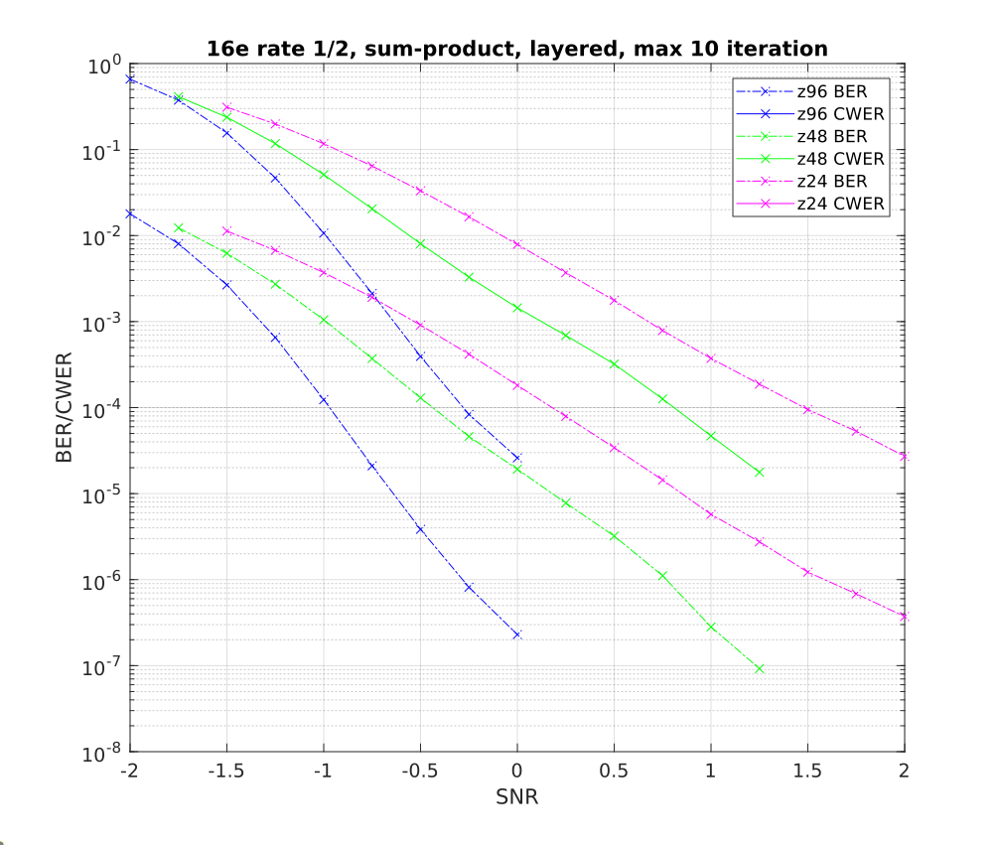

# SIMD-FECFUN: Using SIMD to accelerate FEC-related functions

This is a set of functions for forward error correction (FEC).  The code uses Agner Fog's vector class library (https://github.com/vectorclass - at a minimum get the "version2-master" files).  Currently, only LDPC is supported.

This is a work-in-progess, for a more polished FEC project, one might want to look at aff3ct (https://github.com/aff3ct/aff3ct).  The key difference is that simd-fecfun will hit higher throughputs and lower latencies for decoding.


## Key Components

1. [WGN generation](https://tomt-1.github.io/simd-fecfun/WGN/norm.dist.methods.html)
2. LDPC Encoding (TBD)
3. LDPC Decoding (TBD) 


## Prerequisites

Only tested on Ubuntu, but other Linux distributions should work.  Requires Intel or AMD processor with at
least SSE support, although AVX or AVX-512 is recommended.

Above-mentioned vector class library and environment variable pointing to it:

`VECINC=<path to vector class lib>/version2-master`

Either Octave or Matlab on the path.  If using Octave, set environment variable:

`USEOCT=1`

programming tools: g++/make/perl

## Build and Run

```bash
git clone https://github.com/tomt-1/simd-fecfun
mkdir simd-fecfun/build/tmp
cd simd-fecfun/build
source commands.build-all.src
./run_LDPCsim.pl num_proc=1
```
which will run a default simulation using only 1 process.  Default is 8bit min-sum with beta offset, using the 802.11ad rate 1/2 H matrix.  It produces output similar to this:

```bash
Key Parameters: MatrixSet=11ad 1/2, num_par=1, Decoder=LDPCtop_Vec64c_min, num_proc=1

SNR= -1.00   BER=1.81e-03   CWER=4.20e-02   cw dec/sec=2.52e+05  tot_cw=  1000000
SNR= -0.75   BER=4.07e-04   CWER=1.05e-02   cw dec/sec=3.02e+05  tot_cw=  1000000
SNR= -0.50   BER=7.06e-05   CWER=2.01e-03   cw dec/sec=3.52e+05  tot_cw=  1000000
SNR= -0.25   BER=1.09e-05   CWER=3.47e-04   cw dec/sec=3.99e+05  tot_cw=  1000000
SNR=  0.00   BER=1.82e-06   CWER=6.50e-05   cw dec/sec=4.45e+05  tot_cw=  1000000

Percent time all proc= 100.0%    Approx. Decode percentage= 82.2%
```

In this report, decode percentage is time spent decoding -- the rest is encoding, noise/metric generation and overhead.  The percentage of time in which all processes are executing is also listed (always 100% if num_proc=1).  The codeword decode rate is only measured during this time.  The time after the first process finishes will still impact the error rate totals, but not the reported codewords decoded per second.

Finally, a longer example.  This uses single-precision floating point and the sum-product algorithm.  The tanh/atanh calculations are much slower than min-sum.  The 802.16e LDPC matrices allow for Z sizes from 24 to 96.  Here, we will see the performance for different Z sizes.  From the "build" directory, source example_run.src.  If it takes too long, reduce the num_codeword argument.  After it completes, run matlab or octave and run the final commands:
```bash
rm ldpc_stat.m (if it exists)
source example_run.src
(from a matlab/octave command line:)
linestyles; ldpc_stat
title('16e rate 1/2, sum-product, layered, max 10 iteration');
```
The graph should look something like this:




## License

This project is licensed under the Apache 2.0 license.
